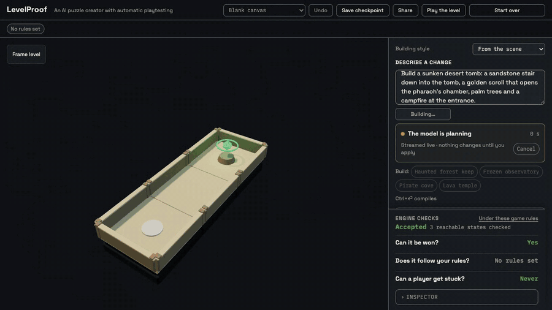
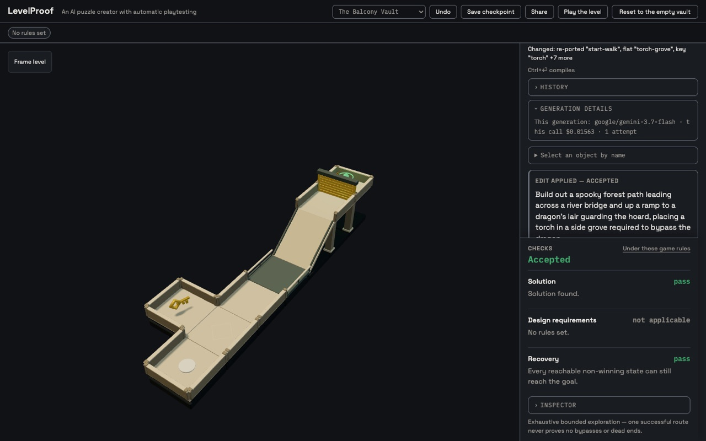
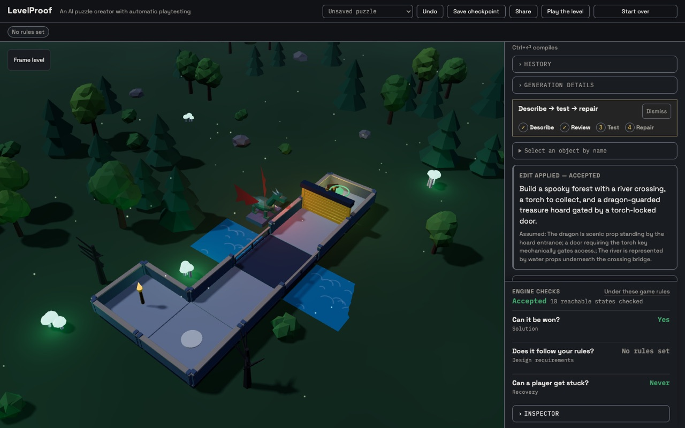
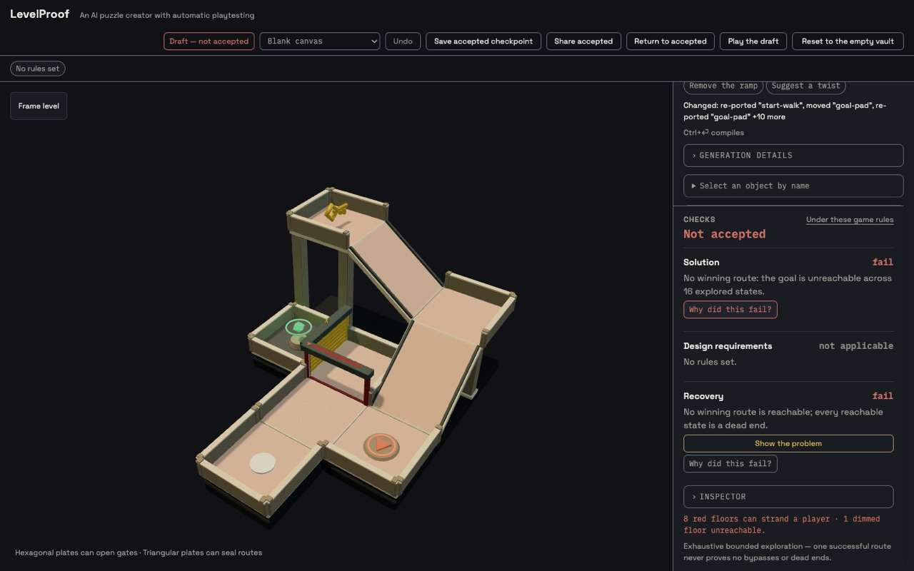
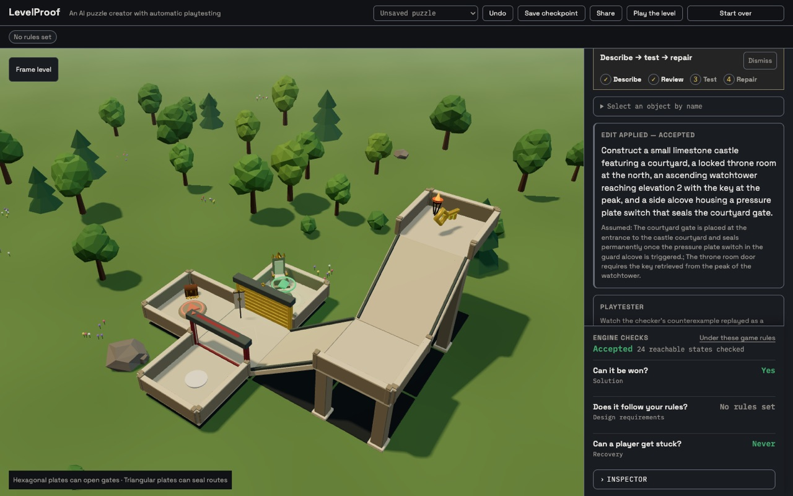
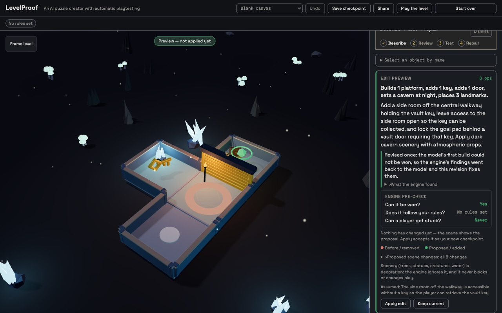

# LevelProof

Build a puzzle world with AI. Watch how it breaks. Fix it without losing the idea.



**Try it:** <https://levelproof.vercel.app>

Describe a small 3D puzzle world in plain language. A live model compiles
your words into typed operations — the rooms, ramps, bridges, keys, switches,
and doors that make the puzzle, plus the scenery that makes it look like what
you said. Then a deterministic playtester explores **every reachable state**
and answers three questions before you accept anything: *Can it be won?*
*Does it follow your rules?* *Can a player get stuck?* When the answer is bad,
you see the failure itself — a ghost replays the doomed route — and you get
fixes that the engine has already checked.

## Type any world

Pick **Blank canvas** and describe a whole puzzle in one sentence, or press
one of the build chips (**Haunted forest keep**, **Frozen observatory**,
**Pirate cove**, **Lava temple**). While the model works you watch its plan
and each operation stream in; the finished world appears as a preview you
approve.

| The same prompt, before | …and now |
|---|---|
|  |  |
| *“Make a spooky forest with a river crossing and a dragon guarding the treasure. The player should need a torch to get past the dragon.”* | A night forest, a river under the bridge, a dragon statue at the hoard, and a key that looks like a torch. The door it opens is the real mechanic; the dragon is honestly labeled scenery. |
|  |  |
| *“A small castle with a tall watchtower. The key is hidden at the top of the tower, and the throne room is locked behind a door that needs it. Add a pressure plate trap that seals the courtyard gate.”* | The watchtower key, the locked throne room, and the sealing trap — built so every reachable state can still win. |

The kit is deliberately small and exact: a 16×16 grid, up to three floor
levels, flat/ramp/bridge modules, up to 3 keys, 4 one-shot switches, and
doors that require keys, require switches, or seal once a switch fires.
Everything the kit cannot *simulate* is expressed as **scenery**:
environments (meadow, forest, swamp, desert, snow, volcanic, cavern, sea,
space, city), day/dusk/night lighting, five building styles, 29 procedural
landmark props (a dragon, a throne, a fountain, braziers, water and lava
tiles…), and key looks (torch, lantern, gem, crown, scroll, keycard…). The
engine never reads scenery — a dragon never blocks a door — and the preview
says so.

## Watch it break


On **The Balcony Vault**, press **Key + locked door**, apply it, then press
**The switch trap**. The trap is legal but deadly: a player who presses the
switch before taking the key seals the gallery door behind them. *Can a
player get stuck?* turns to **Yes**, the stranded floors turn red, and
**Show the problem** replays the exact verified route as a ghost and pauses
on the decisive move. **Why did this fail?** asks the model to narrate the
engine's own facts — the server recomputes the verdict first and checks every
id the model writes against the scene.

## The AI and the engine argue until it works



Every proposal is checked by the engine before you see it; the preview card
shows the **engine pre-check** next to the **Apply** button. When a build
that only *adds* things cannot be won — the model locked the key behind its
own door — the engine's concrete findings go back to the model once
(recomputed on the server, never taken from the client) and the revision is
shown with a disclosure of what the engine found. Edits that remove things
are shown exactly as asked: breaking a level can be the point.

On a failing draft you get two kinds of repair:

- **Ask the AI to fix it** — the model proposes a fix that keeps your idea;
  the engine judges it before you see it.
- **Find checked repairs** — a deterministic search (≤ 24 candidates, ≤ 4
  operations) over four template families: gate the bypass with a keyed door,
  relocate the trapping switch, move the key onto the shortcut, or dissolve
  the trap. Every candidate is fully re-verified; repairs never weaken a
  rule, move the goal, or grant inventory.

## What the AI can edit

The model never emits raw scene JSON. It composes typed operations against an
authoritative scene summary — add/move/remove modules (including bridges
directly over lower corridors), place keys and switches, set door conditions
(`requiresKey`, `requiresKeys` — every listed key — `requiresSwitch`,
`closesAfterSwitch`), move the spawn or goal, rename places, set scenery,
place landmark props, and propose `collectBeforeGoal`, `passThrough`, and
`switchNecessary` design requirements (which you approve — the model cannot
weaken your rules). Ambiguous requests come back as one clarifying question;
mechanics the kit cannot simulate come back as an honest `unsupported` card
with alternatives.

Click anything in the scene — a floor, key, switch, door, or landmark — and
describe the change relative to it (“move this behind that door”). Select
something you care about and press **Keep these**: proposals and repairs that
would change it are refused.

## Three checks, honestly reported

- **Can it be won?** (solution) — is any goal reachable, with a playable
  route?
- **Does it follow your rules?** (design requirements) — does *every*
  winning route satisfy the active requirements? A keyless bypass alongside a
  keyed route still fails.
- **Can a player get stuck?** (recovery) — can every reachable non-goal state
  still win? Reverse search finds the dead ends and witnesses the earliest.

Exploration is bounded and exhaustive (≤ 32,768 states: module × keys ×
switches). If the bound is hit, the check says *check incomplete* instead of
pretending. Player, ghost, verifier, and repair search all call the same core
`step()` over the same catalog polylines; a witness only plays back if it
replays through that engine from the real initial state.

## Model, latency, and cache — disclosed

Compiles run through OpenRouter on `google/gemini-3.8-flash` with low
reasoning effort (fallback `google/gemini-2.5-flash-lite`). Measured on
2026-09-25 (small samples; see [`docs/model-eval.md`](docs/model-eval.md)):

- Direct evaluation battery (27 calls): 27/27 schema-valid, 26/27 semantically
  correct on the first try, 4/4 ambiguity and 2/2 rule-protection cases,
  median 4.7 s.
- The fixed 30-case suite plus 12 repeats through the real endpoint: 41/42.
- Every example chip, twice each: 24/24 (prompt-11; the four blank-canvas
  builds re-checked on the final prompt-12: 4/4).
- Eight one-sentence worlds on the blank canvas: 8/8 valid on the first try,
  7/8 winnable (the eighth is what the revision loop is for), typically
  5–12 s. The previous model (`gemini-3.7-flash`) took 20–33 s on the same
  prompts and produced 6/8 valid.

Latency varies with how long the model chooses to reason: most edits finish
in 3–12 s, and a large build occasionally takes 30 s or more, which is why the
plan and operations stream live. Identical requests — same level, prompt,
selection, kept objects, conversation, prompt version, and model
configuration — are served from an exact-match cache: in memory per server
instance and, when Upstash is configured, in a shared store for 7 days
(entries contain the prompt text). The UI always shows **Fresh compile** or
**Cached result**, with model, cost, and attempts in **Generation details**.
The example chips are prewarmed after each deploy (`scripts/prewarm.ts`).

## Setup and tests

```bash
npm install
cp .env.example .env   # add your OpenRouter key (and optionally Upstash)
npm run dev            # Vite dev server; also serves /api/compile and /api/explain
npm run verify         # typecheck, lint, 248 unit tests, production build
npm run test:e2e       # Playwright browser journeys (fixture-backed, no model calls)
```

Live-model scripts are opt-in, budget-capped, and stop on unknown cost:

```bash
npx tsx scripts/chip-battery.ts --confirm-live-ai --budget-usd 0.50   # every chip, graded
npx tsx scripts/build-battery.ts --confirm-live-ai --budget-usd 0.30  # one-sentence worlds
npm run eval -- --confirm-live-ai --budget-usd 0.40 --models google/gemini-3.8-flash
npx tsx scripts/prewarm.ts --confirm-live-ai --budget-usd 0.40 --url https://levelproof.vercel.app
npx tsx scripts/prop-gallery.ts forest night   # share links showing every prop (visual QA)
```

The deterministic core (`src/core`) has no DOM, renderer, React, or network
imports — the same engine runs in tests, the browser, and the serverless API.
The renderer adapts its quality on slow devices (resolution first, then
terrain shadows and particles). Details: [architecture](docs/architecture.md),
[the movement model](docs/movement-model.md), and the
[evaluation report](docs/evaluation-report.md).

## Provenance and licenses

Submission code is MIT. Built with Three.js, React, Zustand, Zod, Vite, and
Vitest (all MIT); typography is Space Grotesk Variable and IBM Plex Mono (SIL
OFL 1.1, via Fontsource). Every 3D asset — terrain, trees, the dragon, the
props — is built procedurally from Three.js primitives; no imported or
AI-generated assets are used. The model only ever compiles typed operations at
runtime. Pre-window planning notes are private and excluded from this
repository.

> Built for the [AI Builder Hackathon 2026](https://www.victoriavr.com/news/ai-builder-hackathon-2026-build-the-future-of-ai-native-3d-experiences-5915194b) (Victoria VR).
