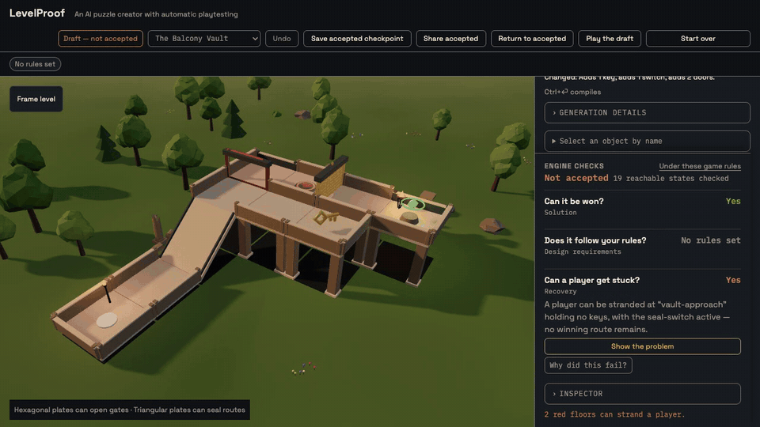

# LevelProof

Build a puzzle with AI. Watch how it breaks. Fix it without losing the idea.



**Try it:** <https://levelproof.vercel.app>

An AI puzzle creator with automatic playtesting. Describe a small 3D puzzle in
plain language; a live model compiles your intent into typed kit operations,
and a deterministic playtester explores every reachable state — then replays
concrete failures (a keyless shortcut, a player who seals themselves in) as a
ghost before you ship them.

## Try it

Open the demo and paste these two prompts in order — each compiles in a few
seconds and the second one is the signature moment:

1. `Put the brass key on the key balcony, and make the vault door require it.`
2. `Add a switch named seal-switch on the vault approach, and a door named
   gallery-door between the gallery and the bridge landing that closes
   permanently after the seal-switch activates.`

Prompt 2 adds a trap: a player who presses the switch before taking the key
seals the gallery door behind themselves. Recovery turns red, and
**The failure — a player gets stranded** replays the exact doomed route as a
ghost. Approve the checked repair and the level turns green again.

When a check fails, **Why did this fail?** asks the model to phrase the
engine's causal story in plain language — the server recomputes the verdict
from your scene before the model writes a word, and its output is checked
against the scene's real ids before it is shown. The engine's verdict always
stands on its own; the narration adds story, never authority.

The header's scene picker also offers three verified showcase levels — **The
Twin Keys** (two keys, two rules), **The Overpass** (a bridge crossing
directly over a lower corridor — true floor-over-floor), and **The Gauntlet**
(a winding climb with a sealing door the checker proves can never strand
you). In every scene the checker's analysis is drawn on the floors: red
tiles can strand a player, dimmed tiles are unreachable — the exhaustive
search made visible (hidden while you play, so it never spoils the puzzle).

You can also play any scene yourself with the keyboard — the same movement
engine the checker uses.

## What the AI can edit

The model never emits raw scene JSON. It composes typed operations against an
authoritative scene summary — add/move/remove modules (flat, ramp, bridge on a
16×16 grid with elevations, including bridges crossing directly over lower
corridors), place keys and one-shot switches, set door conditions
(`requiresKey`, `requiresKeys` — every listed key must be held —
`requiresSwitch`, `closesAfterSwitch`), move the spawn or goal, and propose
`collectBeforeGoal` design requirements (which you approve — the model cannot
weaken your rules). Ambiguous or unsupported requests come back as a
clarifying question or an honest `unsupported` card, never a silent guess.

Pick **Blank canvas** in the scene selector and describe a whole puzzle in one
sentence — from-scratch generation is measured at 6/6 phrasings producing
accepted, fully-verified levels. Or press **Suggest a twist** on any scene and
let the model propose a mechanic the checker immediately judges (a twist that
breaks recovery is the product working: red floors, witness, checked repair).

## Three checks, honestly reported

One successful route proves nothing, so every edit is verified three ways —
each reported as `pass`, `fail`, `check incomplete`, or `not applicable`:

- **Solution** — is any goal reachable, with a playable route?
- **Design requirements** — does *every* winning route collect the required
  key(s)? A keyless bypass alongside a keyed route still fails.
- **Recovery** — can every reachable non-goal state still win? Reverse search
  finds dead ends and witnesses the earliest one.

Incomplete exploration is never green. If the state bound is hit, the check
says so instead of pretending.

## One movement engine, everywhere

Player, ghost, verifier, and search all call the same core `step()` over the
same catalog polylines — floats never decide legality. Exploration is bounded
and exhaustive (≤ 32,768 states: module × keys × switches); the golden fixture
verifies in ~1 ms on the main thread. A witness only plays back if it replays
through that same engine from the real initial state.

## Checked repairs

When an edit breaks a rule, the repair search enumerates deterministic
candidates (≤ 24, ≤ 4 operations, no recursion) from four template families —
gate the bypass with a keyed door, relocate the trapping switch, move the
required key onto the shortcut, or dissolve the trap — fully re-verifies each
against every active rule, and ranks them by a versioned preference that
keeps every entity ahead of destructive fixes and favors fewer changes.
Repairs can never weaken a rule, move the goal, or grant inventory; relaxing
a rule is a separate, explicitly approved diff.

## Model and cache, disclosed

Compiles run through OpenRouter (`google/gemini-3.7-flash`, fallback
`google/gemini-2.5-flash-lite`; chosen by a measured reliability battery —
30+ phrasings graded by the deterministic engine — see
`docs/model-eval.md` and `scripts/reliability.ts`).
Identical requests — same level, rules, prompt, and versions — are served from
an exact-match cache, and the UI always shows whether you are seeing a
**Fresh compile** or a **Cached compile** with its model, cost, and attempt
count in a collapsible inspector. Every result carries the revision it
verified against; stale results are discarded.

## Setup and tests

```bash
npm install
cp .env.example .env   # add your OpenRouter key
npm run dev            # vite dev server
npm test               # vitest: core semantics + fixtures
npm run typecheck && npm run lint && npm run build
```

The deterministic core (`src/core`) has no DOM, renderer, React, or network
imports — the same engine runs in tests, the browser, and the serverless API.
Full details: [architecture](docs/architecture.md) and
[the movement model](docs/movement-model.md).

## Provenance and licenses

Submission code is MIT. Built with Three.js, React, Zustand, Zod, Vite, and
Vitest (all MIT); typography is Space Grotesk Variable and IBM Plex Mono
(SIL OFL 1.1, via Fontsource). No AI-generated assets are used — the model
only ever compiles typed operations at runtime. Pre-window planning notes
are private and excluded from this repository.

> Built for the [AI Builder Hackathon 2026](https://www.victoriavr.com/news/ai-builder-hackathon-2026-build-the-future-of-ai-native-3d-experiences-5915194b) (Victoria VR).
